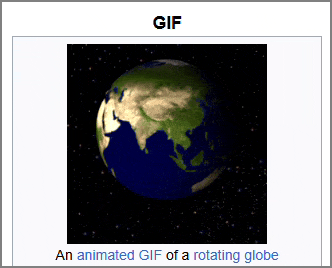
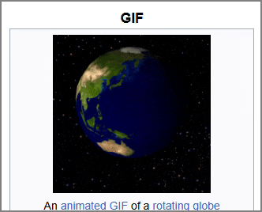
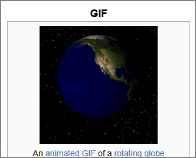

# GIF Controls

A browser extension to add playback controls to GIFs.

- [Features](#features)
- [Building from Source](#building-from-source)
  - [with Docker](#with-docker)
  - [without Docker](#without-docker)

## Features

Right-click any GIF on a page and select "Add Controls":



Scrub, pause, and go frame-by-frame with the controls at the bottom:

 

Adjust the playback speed, play the GIF in reverse, and more:



Resize and move the GIF:


## Building from Source

Use Docker if you want to ensure that the generated extension is exactly the same as the one
submitted to Firefox Addons or the Chrome Web store.

With either method, the built extension will be placed in `.output/<browser>-<manifestVersion>/`.
For Firefox, that's `.output/firefox-mv2/`; for Chrome, it's `.output/chrome-mv3/`.

### With Docker

First, build the Docker image:

```bash
docker build -t gif-controls-build ./build
```

Once that's done, build the extension:

```bash
# All tail args will be passed to `make`, so you can provide any target specified in the Makefile
# after `gif-controls-build`. For instance, provide `firefox` to build just the Firefox version, or
# `zip` for the zipped extension & its sources.
docker run --rm -v "${PWD}:/source" gif-controls-build
```

### Without Docker

Requirements:

- Rust (`rustc` v1.83.0 or higher)
- [`wasm-pack`](https://rustwasm.github.io/wasm-pack/) v0.13.1 or higher
- NodeJS v18 or higher
- `make`

Once you've installed all those,

```bash
make firefox  # To generate the Firefox version of the extension
make chrome   # To generate the Chrome version of the extension
```

Or, to generate both versions:

```bash
make  # Or `make all`
```
